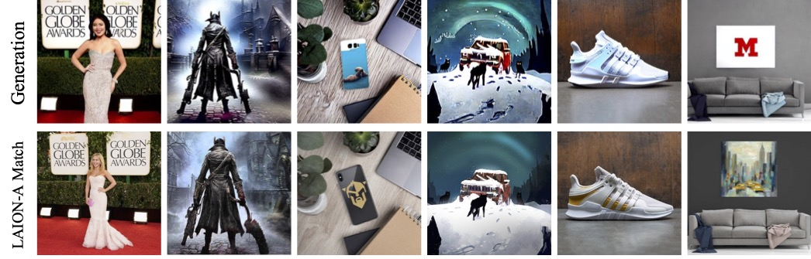

# Diffusion Content Replication study

> <font color="red"> Note: </font> This repo is WIP and some code is yet to be added. Will be completely ready by CVPR conference (June 18, 2023).

This repo contains code for two papers.

1. Diffusion Art or Digital Forgery? Investigating Data Replication in Diffusion Models **(<font color="green">CVPR'23</font>)** - [paper link](https://openaccess.thecvf.com/content/CVPR2023/papers/Somepalli_Diffusion_Art_or_Digital_Forgery_Investigating_Data_Replication_in_Diffusion_CVPR_2023_paper.pdf)
2. Understanding and Mitigating Copying in Diffusion Models - link





## Set up

Install conda environment

```
conda env create -f env.yaml
conda activate diffrep
```
We used RTX-A6000 machines to train the models. For inference or to compute the metrics, smaller machines will do.

## Finetuning a model

```
accelerate launch diff_train.py \
  --pretrained_model_name_or_path stabilityai/stable-diffusion-2-1 \
  --instance_data_dir <training_data_path> \
  --resolution=256 --gradient_accumulation_steps=1 --center_crop --random_flip \
  --learning_rate=5e-6 --lr_scheduler constant_with_warmup \
  --lr_warmup_steps=5000  --max_train_steps=100000 \
  --train_batch_size=16 --save_steps=10000 --modelsavesteps 20000 --duplication <duplication_style>  \
  --output_dir=<path_to_save_model> --class_prompt <conditioning_style> --instance_prompt_loc <path_to_captions_json>

```

- `<duplication_style>` options are `nodup`,`dup_both`,`dup_image`.
- `<conditioning_style>` options are `nolevel`,`classlevel`,`instancelevel_blip`,`instancelevel_random`.
-  To train a model with mitigation, set `--trainspecial <traintime_mitigation_strategy>`. The available options are `allcaps`,`randrepl`,`randwordadd`,`wordrepeat`. 
- For gaussian noise addition in training, set `--rand_noise_lam` to a non-zero value in range `[0,1]`.


## Inference from a finetuned model

```
python diff_inference.py --modelpath <path_to_finetuned_model> -nb <number_of_inference_generations>
```

## Computing metrics

This script computes similairity scores, fid scores and a few other metrics. Logged to `wandb`.

```
python diff_retrieval.py --arch resnet50_disc --similarity_metric dotproduct --pt_style sscd --dist-url 'tcp://localhost:10001' --world-size 1 --rank 0 --query_dir <path_to_generated_data> --val_dir <path_to_training_data>

```

## Mitigation strategy

For train time strategies, train with `--trainspecial` option and infer and compute metrics as shown below

For inference time strategies, 

```
python sd_mitigation.py --rand_noise_lam 0.1 --seed 2
python sd_mitigation.py --rand_augs rand_word_repeat --seed 2
python sd_mitigation.py --rand_augs rand_word_add --seed 2
python sd_mitigation.py --rand_augs rand_numb_add --seed 2
```

## License
This repository is released under the Apache 2.0 license as found in the [LICENSE](LICENSE) file.

## Cite us

Citation for **Diffusion Art or Digital Forgery? Investigating Data Replication in Diffusion Models**
```
@inproceedings{somepalli2023diffusion,
  title={Diffusion art or digital forgery? investigating data replication in diffusion models},
  author={Somepalli, Gowthami and Singla, Vasu and Goldblum, Micah and Geiping, Jonas and Goldstein, Tom},
  booktitle={Proceedings of the IEEE/CVF Conference on Computer Vision and Pattern Recognition},
  pages={6048--6058},
  year={2023}
}
```

Citation for **Understanding and Mitigating Copying in Diffusion Models**
```
Coming soon
```
